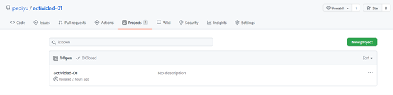
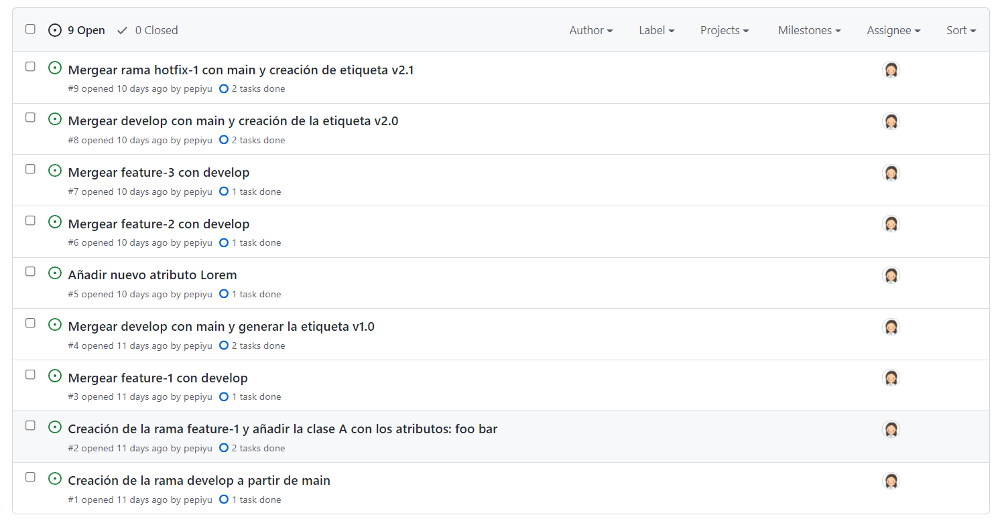
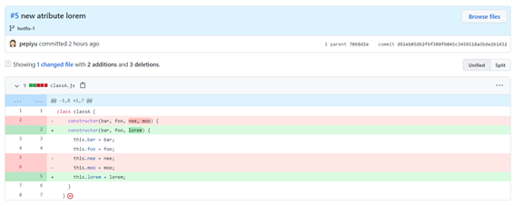

URL Repositorio Github

https://github.com/pepiyu/actividad-01

### Ejercicio 0. Creación del proyecto actividad-01 en Github

En el enlace [Github project](https://github.com/pepiyu/actividad-01/projects) se accede al proyecto Github.




### Ejercicio 1. Crear las tareas en el kanban de Github que consideres necesarias para este proyecto. Las tareas se pueden crear a partir de las actividades que hay a continuación. 

En el enlace [issues](https://github.com/pepiyu/actividad-01/issues) se accede a las tareas creadas en este proyecto.




### Ejercicio 2. Creación de la rama develop a partir de main 

Se crea la rama develop: 

```git branch develop```

### Ejercicio 3. Creación de la rama feature-1 y añadir la clase A con los atributos: foo bar 

Se crea la rama feature-1 y se va a ella: 

```git checkout -b feature-1```

Se añade la clase A con los atributos y posteriormente se añade el cambio: 

```git add classA.js```

Posteriormente, se comitea con el mesage "#2 adding class A" haciendo referencia a la issue #2:

```git commit -m "#2 adding class A"```


En el enlace [issue 2](https://github.com/pepiyu/actividad-01/issues/2) se accede al ejercicio 3 resuelto.
### Ejercicio 4. Mergear feature-1 con develop 

Se va a la rama develop:

```git checkout develop```

Se mergea la rama feature-1 con develop:

```git merge feature-1```

En el enlace [issue 3](https://github.com/pepiyu/actividad-01/issues/3) se accede al ejercicio 4 resuelto.

### Ejercicio 5. Mergear develop con main y generar la etiqueta v1.0 

Se va a la rama main:

```git checkout main```

Se mergea la rama develop:

```git merge develop```

Se crea la etiqueta v1.0 con el mensaje "version 1.0":

```git tag -a v1.0 -m "version 1.0"```

En el enlace [v1.0](https://github.com/pepiyu/actividad-01/releases/tag/1.0) se accede la versión 1.0.


En el enlace [issue 4](https://github.com/pepiyu/actividad-01/issues/4) se accede al ejercicio 5 resuelto.

### Ejercicio 6. Mergear feature-2 con develop 

Se crea una rama nueva llamada feature-2 y se accede a ella:

```git checkout -b feature-2```

Tras realizar cambios, se añade todos los cambios:

```git add .```

Se comitea los cambios con el mensaje "new object":

```git commit -m "new object"```

Se va a la rama develop:

```git checkout develop```

Se mergea la rama feature-2 con la rama develop:

```git merge feature-2```


En el enlace [issue 6](https://github.com/pepiyu/actividad-01/issues/6) se accede al ejercicio 6 resuelto.

### Ejercicio 7. Mergear feature-3 con develop 

Se crea una nueva rama llamada feature-3 y se accede a ella:

```git checkout -b feature-3```

Se añade los cambios:

```git add .```

Se comitea los cambios con el mensaje "new atribute":

```git commit -m "new atribute"```

Se va a la rama develop:

```git checkout develop```

Se mergea la rama feature-3 con la rama develop:

```git merge feature-3```

En el enlace [issue 7](https://github.com/pepiyu/actividad-01/issues/7) se accede al ejercicio 7 resuelto.

### Ejercicio 8. Mergear develop con main y creación de la etiqueta v2.0 

Se va a la rama main:

```git checkout main```

Se mergea la rama develop con la rama main:

```git merge develop```

Se crea la etiqueta v2.0 con el mensaje "version 2.0":

```git tag -a v2.0 -m "version 2.0"```

En el enlace [v2.0](https://github.com/pepiyu/actividad-01/releases/tag/2.1) se accede la versión 2.0.

En el enlace [issue 8](https://github.com/pepiyu/actividad-01/issues/8) se accede al ejercicio 8 resuelto.

### Ejercicio 9. Creación de rama hotfix-1 a partir de main y añadir un atributo lorem en clase A 

Se crea la rama hotfix-1 y se va a ella:

```git checkout -b hotfix-1```

Tras realizar cambios, se añaden todos los cambios:

```git add .```

Se comitea los cambios con el mensaje "#5 new atribute lorem" haciendo referencia a la issue #5:

```git commit -m "#5 new atribute lorem"```

En el enlace [issue 5](https://github.com/pepiyu/actividad-01/issues/5) se accede la issue 5.


 
### Ejercicio 10. Mergear rama hotfix-1 con main y creación de etiqueta v2.1

Se va a la rama main:

```git checkout main```

Se mergea la rama hotfix-1 con la rama main

```git merge hotfix-1```

En el enlace [issue 9](https://github.com/pepiyu/actividad-01/issues/9) se accede al ejercicio 10 resuelto.

Se crea la etiqueta v2.1 con el mensaje "version 2.1":

```git tag -a v2.1 -m "version 2.1"```

En el enlace [v2.1](https://github.com/pepiyu/actividad-01/releases/tag/2.1) se accede la versión 2.1.

En el enlace [Network](https://github.com/pepiyu/actividad-01/network) A la linea de tiempo de las ramas.

