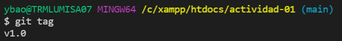
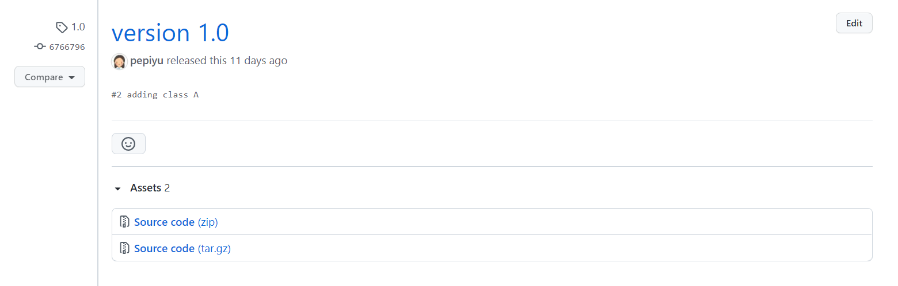

Yessica Bao Ye
03/08/2021
URL Repositorio Github https://github.com/pepiyu/actividad-01

### Ejercicio 0: Creación del proyecto actividad-01 en Github

En el siguiente pantallazo se muestra la creación del proyecto actividad-01 en Github.

### Ejercicio 1: Crear las tareas en el kanban de Github que consideres necesarias para este proyecto. Las tareas se pueden crear a partir de las actividades que hay a continuación. 

En el siguiente pantallazo se muestran todas las tareas creadas en el Kanban del proyecto.

### Ejercicio 2. Creación de la rama develop a partir de main 

Para crear la rama develop: 

`git branch develop`

### Ejercicio 3. Creación de la rama feature-1 y añadir la clase A con los atributos: foo bar 

Para crear la rama feature-1: 

`git branch feature-1`

Se añade la clase A con los atributos y posteriormente se añade el cambio: 

`git add classA.js`

Posteriormente, se comitea con el mesage "#2 adding class A" haciendo referencia a la issue #2:

`git commit -m "#2 adding class A"`

### Ejercicio 4. Mergear feature-1 con develop 

Nos vemos a la rama develop:

`git checkout develop`

Mergeamos la rama feature-1:

`git merge feature-1`

### Ejercicio 5. Mergear develop con main y generar la etiqueta v1.0 

Nos vemos a la rama main:

`git checkout main`

Mergeamos la rama develop:

`git merge develop`

Mergeamos la rama develop:

`git tag -a v1.0 -m "version 1.0"`

### Ejercicio 6. Mergear feature-2 con develop 

`git checkout -b feature-2`

`git add .`

`git commit -m "new object"`

`git checkout develop`

`git merge feature-2`

### Ejercicio 7. Mergear feature-3 con develop 

`git checkout -b feature-3`

`git add .`

`git commit -m "new atribute"`

`git checkout develop`

`git merge feature-3`

### Ejercicio 8. Mergear develop con main y creación de la etiqueta v2.0 

`git checkout main`

`git merge develop`

`git tag -a v2.0 -m "version 2.0"`

### Ejercicio 9. Creación de rama hotfix-1 a partir de main y añadir un atributo lorem en clase A 

`git checkout -b hotfix-1`

`git add .`

`git commit -m "#5 new atribute lorem"`

 
### Ejercicio 10. Mergear rama hotfix-1 con main y creación de etiqueta v2.1

`git checkout main`

`git merge hotfix-1`

`git tag -a v2.1 -m "version 2.1"`

